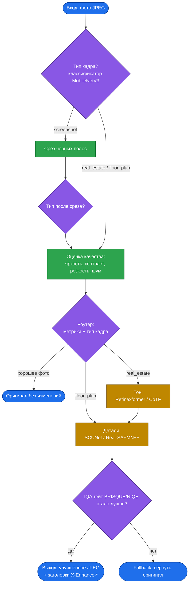

<div align="center">

# Автоулучшение фото

**Команда «Крутые бобры»**

Алексей Исаков (капитан) · Дмитрий Баяндин

</div>

## Цель

Сервис автоматически находит некачественные фото объявлений недвижимости (тёмные, шумные, размытые, пересвеченные, с цветовым сдвигом) и улучшает их ML-моделями. Чистое и понятное фото лучше считывается покупателем и повышает шанс, что объявление дойдёт до контакта с продавцом, при этом сервис не дорисовывает несуществующих деталей (доверие важнее красоты) и укладывается в SLA p99 ≤ 1 с на фото 1080p.

По эвристикам команды улучшения требуют 38 831 из 100 000 фото недвижимости. Улучшение фото должно повышать число покупок на Avito.

## Как работает пайплайн



## Метрики

**Бизнес-метрики:**

| Метрика               | Что это |
|-----------------------|---|
| conversion_to_contact | целевые действия (звонок, сообщение, избранное, покупка) / просмотры объявления |
| preference rate       | доля выборов «улучшено» в слепом сравнении с оригиналом |
| SLA p99               | время обработки одного фото 1080p |
| RPS                   | пропускная способность сервиса |

**Метрики качества изображения:**

| Метрика | Что измеряет |
|---|---|
| `brightness_mean`, `contrast_std` | яркость и контраст |
| `sharpness_laplacian_var` | резкость (дисперсия лапласиана) |
| `noise_sigma` | уровень шума |
| `entropy` | информативность изображения |
| `PSNR`, `SSIM` | близость к эталону по пикселям и структуре (выше лучше) |
| `LPIPS` | перцептивное отличие от эталона (ниже лучше) |
| `BRISQUE`, `NIQE` | no-reference качество, основа IQA-гейта (ниже лучше) |

## Запуск

```bash
bash infra/deploy/bootstrap.sh   # один раз: docker + nvidia-container-toolkit
make install
make weights
make up-gpu
make logs-gpu
```


## HTML

```bash
services/enhancer/.venv/bin/python scripts/eval_endpoint.py --html data/eval_set/report
```
